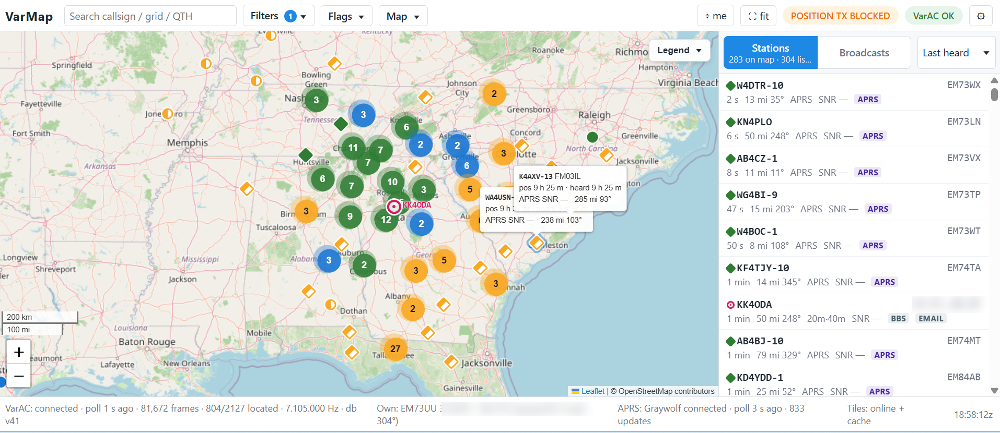

# VarMap — VarAC position mapping companion

VarMap watches a running (or stopped) VarAC installation, extracts every station
position it can find, and plots the network on a map. It can also read your own
position from VarAC and transmit it through VarAC, either at a fixed interval or
with smart timing. Map tiles are cached locally and whole regions can be
downloaded for offline use. With [Graywolf](https://github.com/chrissnell/graywolf)
alongside, the APRS network shares the same map.



*Circles are VarAC stations coloured by position age, diamonds are APRS stations
heard through Graywolf, the magenta ring is the operator's own station, and
numbered badges are clusters. The status bar shows VarAC polling, the own
position source and the live APRS feed.*

VarAC has no API. VarMap integrates the way HamLink does: it reads VarAC's SQLite
database **read-only**, reads VarAC's `.ini`, tails VarAC's optional GPS log, and
(only for transmitting) drives VarAC's Windows GUI. It never writes to VarAC's
database.

## Install

**Windows (VarAC users).** Download the latest `VarMap-Setup-<version>.exe` from the
[Releases page](https://github.com/KK4ODA/VarMap/releases) and run it. It installs
per-user (no administrator prompt), adds a Start-menu and optional desktop shortcut,
and can start with Windows. Prefer no installer? Take the
`VarMap-<version>-windows-x64-portable.zip`, unzip anywhere, run `VarMap.exe`.

**macOS / Linux.** Map-only builds are on the same page as `.tar.gz` archives: unpack,
run `./VarMap`, open http://127.0.0.1:5001. VarAC itself is a Windows program, so
these builds are for mapping a VarAC database you can read (VarAC under Wine, or a
copied/shared `VarAC.db`); transmitting through VarAC's window is Windows-only. The
macOS binary is not code-signed: use right-click > Open the first time.

**From source** (any platform with Python 3.11+):

```bat
git clone https://github.com/KK4ODA/VarMap.git
cd VarMap
start_varmap.bat          :: Windows: installs dependencies and starts
python -m pip install -r requirements.txt && python -m varmap    # macOS / Linux
```

Settings (`config.json`) and data (`varmap.db`, `tiles.mbtiles`, `varmap.log`) live in
`%LOCALAPPDATA%\VarMap` for installed builds and beside the app when run from source.
They survive upgrades and uninstalls.

## Quick start

Start VarAC, then VarMap. VarMap opens `http://127.0.0.1:5001` in your browser. With
VarAC installed at `C:\VarAC` nothing needs configuring; otherwise open Settings →
VarAC and point it at your `VarAC.db` (Test database confirms it). The first run
backfills the entire beacon history (about 40 s for 80,000 frames); after that VarMap
polls every 10 s.

Other entry points:

```bat
python -m varmap --status          :: discovery + database check, no UI
python -m varmap --test-db C:\VarAC\VarAC.db
python -m varmap --dump-windows    :: list VarAC's controls (GUI automation)
python -m pytest -q tests          :: unit + offline integration tests
```

## Updating

VarMap checks GitHub for a newer release at start-up and every 12 hours (only the
version number is fetched; nothing about you is sent). When one exists an orange
**Update** pill appears in the top bar:

- **Installed Windows build**: click it and choose *Install now*. VarMap downloads
  the new installer, verifies its size and SHA-256 checksum against the release's
  `SHA256SUMS.txt`, closes, installs silently and reopens. Settings and the station
  database live in `%LOCALAPPDATA%\VarMap` and are untouched.
- **Portable zip, macOS, Linux, source**: the pill opens the release page; replace
  the files (or `git pull`) yourself.

Settings → Display has *Check for updates automatically*, *Check now* and *Skip this
version*.

## Where positions come from

| Source | Precision | Notes |
|---|---|---|
| Advanced beacon / CQ (`cqframe.locator`) | 6-char grid, ±4 km | The bulk of the data. Standard beacons carry no locator, so ~2/3 of callsigns are "heard but unlocated". |
| Broadcast text | exact if `<GPS:…>`, else grid | `<LOC:EM73WX>` tags and bare grids like `(DM33vo)` are recognised. |
| VMail `<GPS:…>` tag | exact | Highest-precision source VarAC carries; VarAC's own `<GPSLOC>` macro produces it. |

Grid positions are shown as the cell centre with the grid rectangle on hover.
Position age and last-heard are always shown separately. Implausible jumps
(>900 km/h) are kept but flagged.

## Your own position

Priority (Settings → My position): VarAC's GPS log (`WriteGPSDataToFile=ON`) →
an NMEA GPS on a COM port VarAC is not using → `ManualGPSData` → `MyLocator`.
VarAC V15 writes one line per second: `2026-09-02 22:11:55,Lat: 33°50.3528 N Long: 084°16.5223 W`
(empty values while there is no fix); the reader also accepts raw NMEA and
`lat,lon` lines and takes the last parseable line. Speed and course come from NMEA RMC or are derived from
successive fixes.

## Position TX: broadcasting your position through VarAC

Off by default and starts in **dry run**. Two methods:

- **Broadcast** (recommended): VarMap fills VarAC's Broadcast dialog with a
  message built from a template, e.g. `<GPS:33.86000,-84.30000> EM73UU VarMap`
  (max 150 bytes). Exact coordinates; other VarMap users map it directly.
- **One-time VarAC beacon** (experimental): right-clicks VarAC's Beacon
  button. Grid only. Verify with `--dump-windows` and `VarAC.log`.

**Start auto position TX** arms the scheduler: the first broadcast goes out one
interval later, then per the timing mode, until **Stop**. **Send position once now** is a single
manual transmission and never starts the scheduler.

Built-in anti-spam limits that no setting can relax: at least 5 minutes
between automatic transmissions (the manual buttons need 60 s), a stationary station
repeats itself at most every 30 minutes, at most 6 transmissions per hour
(default 2) and 48 per day. "Only if moved" is on by default and asks for
confirmation before it is switched off.

Smart timing is refused on VarAC's calling frequencies (the "STD VARAC FREQS"
section of `VarAC_frequencies.conf`, ±3 kHz to cover the slots); VarMap reads
VarAC's current frequency from `VarAC.log` and blocks with a clear message. Use
Fixed interval there, or QSY to a tracker frequency. The smart defaults follow
HF APRS practice (roughly every 10 minutes while moving, hourly when parked);
a VHF profile for VARA FM is one click away.

**Preferred bands.** With VarAC's frequency scanner running, a broadcast would go
out on whatever band the scanner is on at that moment. List the bands you want in
Position TX (e.g. `40m, 20m`) and VarMap holds every broadcast, automatic or manual,
until VarAC lands on one of them (it reads VarAC's current frequency from `VarAC.log`).
A queued manual send gives up after a configurable wait and can be cancelled.
When the scanner is hopping, VarMap starts a send only in the first seconds of a stop on a
preferred band and re-checks the band right before the final click, because VarAC queues the
broadcast until the channel is clear and a late start would go out on the next band. The
frequency VarAC really transmitted on is read back from `VarAC.log` and shown in the TX log.

**A parked station is silent.** "Only if moved" (on by default in both timing modes) means a
station that has not moved since its last broadcast sends nothing at all. Switch it off and the
plain schedule applies: every interval in fixed mode, the slow rate in smart mode. There is no
separate keepalive.

VarMap also holds off while VarAC is busy: it reads VarAC's button states and
will not hand over a broadcast while VarAC is connected to a station (QSO,
VMail, ping, file transfer, when VarAC disables BROADCAST) or while the
operator has the Broadcast window open. After any failed hand-over it waits two
minutes before trying again, and the scheduled broadcast goes out as soon as
VarAC is free.

Channel courtesy is VarAC's job: a broadcast VarMap hands over sits in VarAC's
queue "until the frequency is cleared (NOT BUSY)". The **DCD guard** setting (on
by default) reads VarAC's "Ignore DCD" checkbox and refuses to hand over a
broadcast while it is ticked, since that switches VarAC's busy-channel
protection off.

Timing: fixed interval (only when moved by default) or smart timing
(speed-scaled interval, corner pegging, grid-change trigger with dwell
hysteresis, only-if-moved). Interlocks that no setting can override: callsign
required, no fix → no transmit, fix-age limit, per-hour and per-day limits, 5-minute
spacing, VarAC must be running, everything logged. **Stop auto position TX** is the
kill switch; **Test VarAC dialog (no TX)** rehearses the automation without sending. GUI automation briefly steals focus and needs VarAC's interface
language set to English.

## APRS via Graywolf

VarMap talks to [Graywolf](https://github.com/chrissnell/graywolf), a modern APRS
station (software modem, digipeater, iGate, web UI), through Graywolf's REST API.
Settings → APRS holds the Graywolf URL (default `http://127.0.0.1:8080`) and a
Graywolf login (Graywolf has no API keys; use a dedicated account, the password is
kept in `config.json`).

**Receive (always safe)**

- APRS stations appear as diamond markers (squares for APRS objects) with exact
  coordinates, symbol and comment; filter with *Position source = APRS* or hide
  them in Flags.
- Your own position can come from Graywolf's GPS, with speed and heading.

**Transmit (off by default, dry run by default, every action logged)**

- **Mirror**: after each real VarAC position broadcast, VarMap fires its own APRS
  position beacon in Graywolf with the same fix.
- **Relay VarAC stations as APRS objects**: only stations whose latest VarAC
  broadcast carried the consent token `APRS:Y`. Objects go to APRS-IS only by
  default, carry APRS position ambiguity for grid-only positions (a 6-character
  grid is a 4 x 8 km cell, not a point), are rate-limited (default 10 per hour,
  hard cap 30; per-station spacing at least 10 minutes), lapse when consent is
  not restated (default 30 days) and are retired when the station goes quiet.
  `APRS:N` withdraws consent immediately. The rule lives in the server query,
  not in the UI.
- **Relay an APRS station to VarAC**: a button in the station panel broadcasts
  `APRS <call> <GPS:…> via <you>` once, subject to every Position TX interlock.

**The consent token.** Tick *Allow others to relay my position to APRS* in
Position TX and your broadcasts end with `APRS:Y` (six bytes, human-readable, so
VarAC users without VarMap can adopt it too). Anyone running VarMap with object
relaying enabled may then put your VarAC position on APRS under their callsign.
No token means no.

## Offline maps

Every tile viewed is cached in `tiles.mbtiles`. Settings → Offline maps lets you
download a region (use the current view, choose a zoom range, estimate, download)
with progress and cancel. OpenStreetMap's tile policy discourages bulk
downloads — keep regions modest or set a different tile source URL. Turn off
*Fetch tiles while online* to run purely from the cache.

## Layout

```
varmap/
  integration/   the only code that knows VarAC exists (db, ini, gps log, GUI)
  domain/        pure logic: grid codec, GPS-tag parser, precedence, smart timing policy
  storage/       our SQLite schema + repository (cursor advanced inside the write txn)
  services/      poller, own-position tracker, position-TX service, tiles
  web/           Flask API + Leaflet UI
tests/           85 tests: unit, policy limits, and an offline end-to-end ingest test
```

Design background: `VarAC_Position_Mapping_Companion_Design.md` in the HamLink
folder.

## Releasing (maintainer)

```bat
release.bat 0.2.0
```

bumps the version, runs the tests, commits, tags `v0.2.0` and pushes. GitHub Actions
(`.github/workflows/release.yml`) then builds the Windows installer and portable zip,
the macOS (Intel and Apple Silicon) and Linux packages, and publishes them with
auto-generated notes on the Releases page. Every push to `main` runs the test suite
on Windows and Linux (`ci.yml`).

## Credits and license

VarMap is MIT licensed (see `LICENSE`). It builds on lessons from
[HamLink](https://github.com/KK4ODA) and on the excellent VarAC by 4Z1AC. Maps by
[Leaflet](https://leafletjs.com) and [OpenStreetMap](https://www.openstreetmap.org/copyright)
contributors. VarMap is not affiliated with VarAC; it never writes to VarAC's database.
